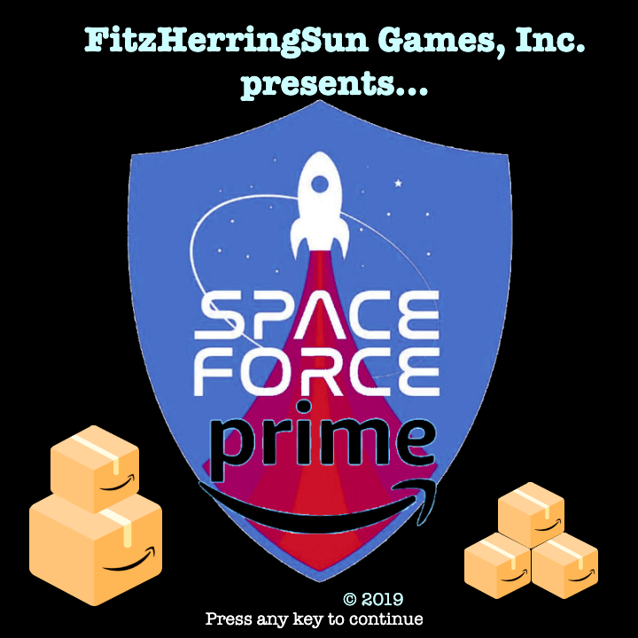
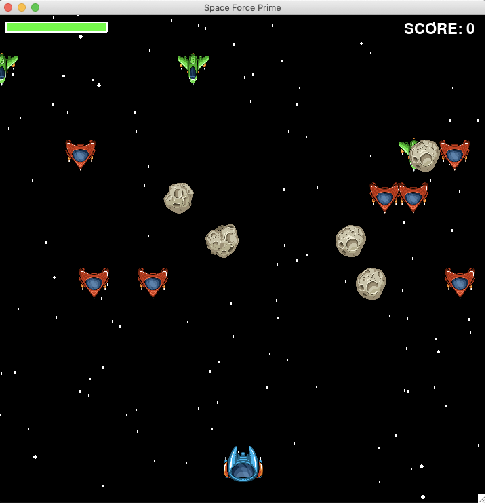

# Space Force Prime - pygame Project

  

<!--  -->

## Contents
    -Description & Game Design
    -Storyline
    -Features
    -Technologies
    -Stretch Goals
    -Authors
    -Screenshots

## Decription & Game Design
"Space Force Prime" is a Python3-only application designed as a single-player top-down scrolling space shooter game. 

The player's score increases with each successful package delivery, and each destroyed enemy ships. The score decreases when the player misdelivers a package to an enemy ship, or destroys a friendly ship. Health starts at 100% and is reduced with each collision - whether it be with any ship or asteroid.

As the player's score increases, so does the difficulty of the game - more enemy ships, less friendly ships, more asteroids to avoid.

## Storyline
It's the year 2069 (nice!), and President Barron Trump's U.S. Space Force program is in ruins. Amazon's Cyborg CEO, Jeff Bezos 4.0, just bought out the derelict military branch.

As a newly-hired delivery human, it's your job to deliver packages to Prime customers while defending your ship, crew, and cargo.

Good luck  ...and watch out for asteroids!

### Features
* Scrolling text introduction to premise behind the game
* Introduction screen, displaying logo and game elements
* Instructions screen, displaying game maneuvering parameters and game elements
* 'Press any key' option to continue through menu
* Play Parameters
  * 4-way player movement
  * Separate keys for package and weapon deployment
  * Player Health indicator bar
  * Score display
* Animation
  * Dynamic starry background
  * Several distinct impact explosions
  * Package delivery rating system (stars)
* Audio
  * Seamless looping background music
  * Unique audio feedback for package deployment, package delivery success, package misdelivery, weapon deployment, enemy destruction, accidental friendly ship destruction
* Game Over screen with 1-button redirect option: Play again, or Quit

## Technologies
* Python3
* pygame

<!-- ## Challenges and Solutions -->
## Stretch Goals
* High score tracking with player name input
* Add firepower to enemy ships
* Augment gameplay with Levels feature
* Implement 2-player version

## Authors
* Christopher Zach Herrington
    * Contributions:
        * Concept, Feature Design, Layout, Coding, Compilation & Change Management, Dynamic Animation
    
    [Zach's GitHub Profile](https://github.com/CZHerrington)

* Puja Fitzpatrick
    * Contributions:
        * Concept, Feature Design, Coding, Graphics, Audio, ReadMe
    
    [Puja's GitHub Profile](https://github.com/pujafitz)

* Pescott Sun
    * Contributions:
        * Concept, Feature Design, Coding, File Structure, Difficulty Banding, Audio
    
    [Prescott's GitHub Profile](https://github.com/MAOneill)

## Screenshots

* Introduction Screens:

    
  

  

    
  

* Gameplay

    
  

  

    
  

* Game Over

    
  
